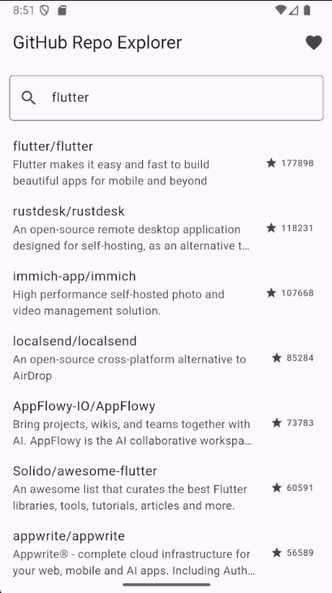
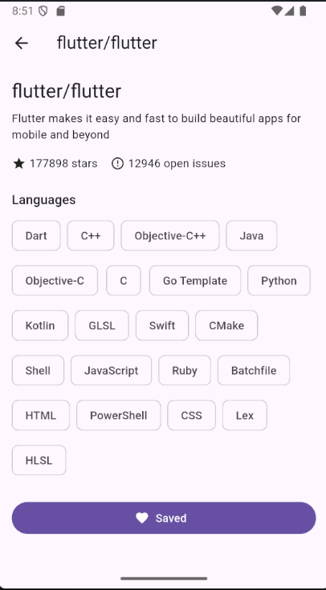

# GitHub Repo/User Explorer

A Flutter application for searching GitHub repositories and users, viewing repo details, and saving favorites — built as a focused demonstration of Clean Architecture, reactive state management, and offline-aware local persistence in Flutter.

## Overview

The app consumes the public [GitHub REST API](https://docs.github.com/en/rest) directly (no custom backend). A user searches for a repository or user, browses paginated results, opens a detail screen with language breakdown and issue counts, and can favorite repos for later — with favorites persisted locally across app restarts.

The project is intentionally scoped: rather than being a broad feature showcase, it is built to demonstrate production-grade architecture, error handling, and test coverage on a small, real-world surface area.

## Features

- **Search** — debounced search across repositories via `GET /search/repositories`.
- **Infinite scroll** — real, API-backed pagination (not simulated).
- **Repo details** — full description, primary/secondary languages, open issue count, star count.
- **Favorites** — save/unsave repos locally (Hive CE), persisted across app restarts.
- **Distinct error states** — rate-limited (HTTP 403), offline, and empty-results each render their own meaningful UI rather than a generic error screen.

## Architecture

Clean Architecture with a strict dependency direction (`presentation -> domain <- data`):

```
lib/
├── domain/
│   ├── core/             # Failure (sealed error hierarchy), Result<T> (success/error union)
│   ├── entities/         # GitHubRepo, GitHubUser
│   ├── usecases/         # SearchRepositories, GetRepoDetail, ToggleFavorite
│   └── repositories/     # GitHubRepository (abstract contract)
│
├── data/
│   ├── remote/           # GitHubApiClient (Dio), DTOs, typed API exceptions
│   ├── local/            # FavoritesLocalDataSource (Hive CE)
│   └── repositories/     # GitHubRepositoryImpl (remote + local, maps exceptions -> Failure)
│
└── presentation/
    ├── riverpod/         # SearchNotifier, FavoritesNotifier (AsyncNotifier), providers.dart (DI graph)
    ├── screens/          # SearchScreen, RepoDetailScreen, FavoritesScreen
    └── router/           # app_router.dart (go_router routes)
```

**Why this structure:**

- The `domain` layer holds business rules only — no Flutter widgets, no HTTP client, no storage details. It is the layer least likely to change. Success/failure is modeled explicitly with a `Result<T>` union type and a sealed `Failure` hierarchy (`NetworkFailure`, `RateLimitFailure`, `ServerFailure`, `CacheFailure`) instead of nullable fields or thrown exceptions, so error handling is exhaustive and compiler-checked.
- The `data` layer implements the `GitHubRepository` contract, deciding whether a given request is served from the network or from local storage, and mapping raw API DTOs and exceptions to domain entities and `Failure`s.
- The `presentation` layer owns UI state and rendering only, via Riverpod `AsyncNotifier`s that expose loading/data/error states directly to the widget tree, and `go_router` for declarative, URL-based navigation.

This separation means the API client, storage engine, or UI framework could each be swapped independently without touching the others.

## Tech Stack

| Concern | Choice |
|---|---|
| Language | Dart |
| Framework | Flutter (Android + iOS) |
| State management | Riverpod (`AsyncNotifier`) |
| Routing | go_router |
| Networking | Dio |
| Local persistence | Hive CE (`hive_ce` / `hive_ce_flutter`) |
| Testing | `flutter_test`, `mocktail` |

## Error Handling

The GitHub API's real constraints are used deliberately as a testbed for error handling, rather than working around them:

- **Rate limiting** — a 403 response with `X-RateLimit-Remaining: 0` is caught and surfaced with a dedicated "rate limited, try again at [time]" UI.
- **No connectivity** — network failures are caught at the repository layer and mapped to a distinct offline state.
- **Empty results** — a successful response with zero results renders its own empty-state UI, distinct from an error.

## Testing

Because the app depends on an external API, all tests run without a live network connection:

- **Unit tests** — usecases, repository logic, and DTO-to-entity mappers, with the API client mocked via `mocktail`.
- **Widget tests** — search screen across loading/success/error/empty states; repo detail screen.
- **Integration test** — end-to-end search -> detail -> favorite flow against a mocked API layer.

Run tests:

```bash
flutter test
```

## Getting Started

### Prerequisites

- Flutter SDK 3.44.2 or later (stable channel) — bundles Dart SDK ~3.12.x
- Dart SDK (bundled with Flutter, no separate install needed)

### Setup

```bash
git clone https://github.com/payamomidvar/github_repo_explorer.git
cd github_repo_explorer
flutter pub get
flutter run
```

No API key is required — the app uses GitHub's unauthenticated API tier (60 requests/hour). To raise this limit during development, generate a [personal access token](https://github.com/settings/tokens) (no scopes needed for public read access) and pass it at launch:

```bash
flutter run --dart-define=GITHUB_TOKEN=your_token_here
```

## Screenshots

<!-- Add screenshots here once the app is running, e.g.: -->
<!-- | Search | Repo Detail | Favorites | -->
<!-- |---|---|---| -->
<!-- |  |  |  | -->

## Before Publishing

> **Note:** The app/package id (`com.example.github_repo_explorer` on Android, `com.example.githubRepoExplorer` on iOS) is a placeholder left over from project scaffolding. Change it to a real reverse-domain id — in `android/app/build.gradle.kts` and the iOS bundle identifier in `ios/Runner.xcodeproj` — before publishing to any app store.

## Project Scope

This project is one part of a broader Flutter skills roadmap and is scoped deliberately, not comprehensively:

- Primary focus: **architecture** (Clean Architecture, Repository pattern, dependency injection, Riverpod state management) and **testing** (unit, widget, integration).
- Secondary, lighter coverage: Dart language features used naturally in context (generics, null safety, extension methods), Flutter rendering internals relevant to list performance (keys, rebuild scoping), and a minimal slice of local persistence.
- Explicitly out of scope: platform channels, offline sync/conflict resolution, and app-size/performance-profiling work at scale — reserved for future projects.

## License

MIT
